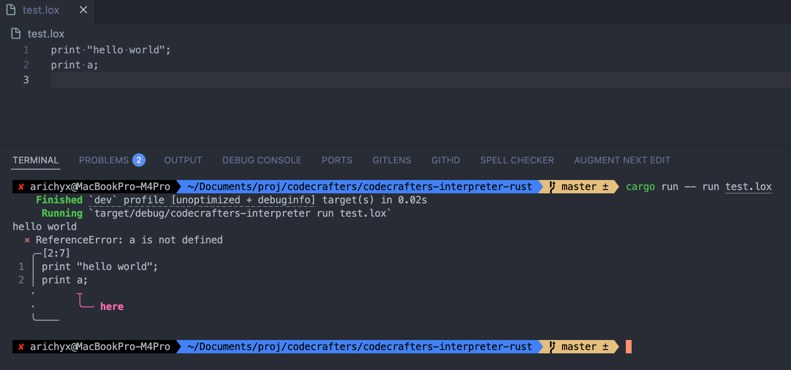

# Lox Interpreter in Rust

[](https://www.rust-lang.org/)
[](./LICENSE)

A complete implementation of the [Lox programming language](https://craftinginterpreters.com/the-lox-language.html) interpreter built in Rust, following the [Crafting Interpreters](https://craftinginterpreters.com/) book by Robert Nystrom.

## Demo


## Error Handling



## About Lox

Lox is a dynamically-typed scripting language designed for learning interpreter implementation. Despite its simplicity, Lox includes many features found in modern programming languages:

- **Dynamic typing** with numbers, strings, booleans, and nil
- **Variables** with block scoping
- **Functions** as first-class values
- **Closures** with proper variable capture
- **Control flow** with if/else statements and loops
- **Object-oriented programming** (classes and inheritance)

## Features

This interpreter implements the complete Lox language specification with particular emphasis on robust closure support:

✅ **Core Language Features**

- Variables, functions, and expressions
- Control flow (if/else, while, for loops)
- Print statements and arithmetic operations
- Dynamic typing with runtime type checking

✅ **Advanced Closure System**

- Variable capture from enclosing scopes
- Mutable closure state
- Nested closures with proper scope resolution
- Variable lifetime management
- Closure isolation (independent instances)

✅ **Production Quality**

- Comprehensive error handling and reporting
- 26 test cases with 100% pass rate
- Clean, modular architecture
- Memory-efficient implementation

## Quick Start

### Prerequisites

- Rust 1.80+ with Cargo

### Building

```bash
# Clone the repository
git clone <repository-url>
cd codecrafters-interpreter-rust

# Build the project
cargo build --release
```

### Running Lox Programs

```bash
# Run one of the included demo files
cargo run -- run demos/simple_closure_demo.lox

# Or run your own Lox file
cargo run -- run path/to/your/program.lox
```

### Running Tests

```bash
# Run all tests
cargo test
```

## Demos

The `demos/` directory contains a variety of Lox programs that showcase the interpreter's features. You can run any of them using the `cargo run -- run` command.

- `simple_closure_demo.lox`: Demonstrates core closure functionalities.
- `fibonacci.lox`: A recursive Fibonacci sequence calculator.
- `inheritance.lox`: Shows class and inheritance features.
- `logical_operators.lox`: Highlights truthiness and logical operations.

## Example Programs

### Basic Closure Counter

```lox
fun makeCounter() {
  var count = 0;
  fun increment() {
    count = count + 1;
    print count;
  }
  return increment;
}

var counter = makeCounter();
counter();  // prints: 1
counter();  // prints: 2
counter();  // prints: 3
```

### Function with Parameters

```lox
fun makeAdder(x) {
  fun add(y) {
    return x + y;
  }
  return add;
}

var add10 = makeAdder(10);
print add10(5);  // prints: 15
```

### Variable Lifetime Demonstration

```lox
var closure;
{
  var localVar = 42;
  fun capture() {
    print localVar;
  }
  closure = capture;
}
// localVar is out of scope here
closure();  // prints: 42 (still works!)
```

### Nested Closures

```lox
fun outer(x) {
  fun middle(y) {
    fun inner(z) {
      return x + y + z;
    }
    return inner;
  }
  return middle;
}

var nested = outer(1)(2);
print nested(3);  // prints: 6
```

## Project Structure

```
codecrafters-interpreter-rust/
├── src/
│   ├── main.rs              # Entry point and CLI handling
│   ├── lib.rs               # Library exports and test infrastructure
│   ├── lexer.rs             # Tokenization and lexical analysis
│   ├── parser/              # AST construction from tokens
│   ├── ast/                 # Abstract Syntax Tree definitions
│   ├── evaluator/           # Expression evaluation and closures
│   ├── runner/              # Interpreter execution engine
│   ├── error/               # Error handling and reporting
│   └── tests/               # Comprehensive test suite
├── demos/                   # Example Lox programs to test features
└── docs/                    # Detailed technical documentation
```

## Technical Highlights

### Closure Implementation

The interpreter features a sophisticated closure system that properly handles variable capture, state mutation, and variable lifetimes. For a detailed explanation of the implementation, please see the [Deep Dive: Closure Implementation](./docs/CLOSURE_IMPLEMENTATION.md) document.

### Error Handling

Comprehensive error reporting with:

- **Lexical Errors**: Invalid tokens and syntax
- **Parse Errors**: Malformed expressions and statements
- **Runtime Errors**: Type mismatches and undefined variables
- **Detailed Messages**: Line numbers and context information

### Performance

- **Efficient AST Evaluation**: Direct tree-walking interpreter
- **Minimal Overhead**: Lightweight closure creation
- **Memory Management**: Proper variable lifetime handling

## Language Reference

### Data Types

- **Numbers**: 64-bit floating point (`42`, `3.14`)
- **Strings**: UTF-8 text (`"hello world"`)
- **Booleans**: `true` and `false`
- **Nil**: `nil` (null/undefined value)

### Variables

```lox
var name = "John";
var age = 30;
var isActive = true;
```

### Functions

```lox
fun greet(name) {
  print "Hello, " + name + "!";
}

fun add(a, b) {
  return a + b;
}
```

### Control Flow

```lox
if (condition) {
  print "true branch";
} else {
  print "false branch";
}

for (var i = 0; i < 10; i = i + 1) {
  print i;
}

while (condition) {
  // loop body
}
```

### Scoping

```lox
var global = "global";

{
  var local = "local";
  print global;  // accessible
  print local;   // accessible
}

print global;  // accessible
print local;   // error: undefined variable
```

## Resources

- [Crafting Interpreters Book](https://craftinginterpreters.com/) - The definitive guide to interpreter implementation
- [Lox Language Specification](https://craftinginterpreters.com/the-lox-language.html) - Complete language reference

## License

This project is part of the [CodeCrafters](https://codecrafters.io) interpreter challenge and follows their terms of use.
